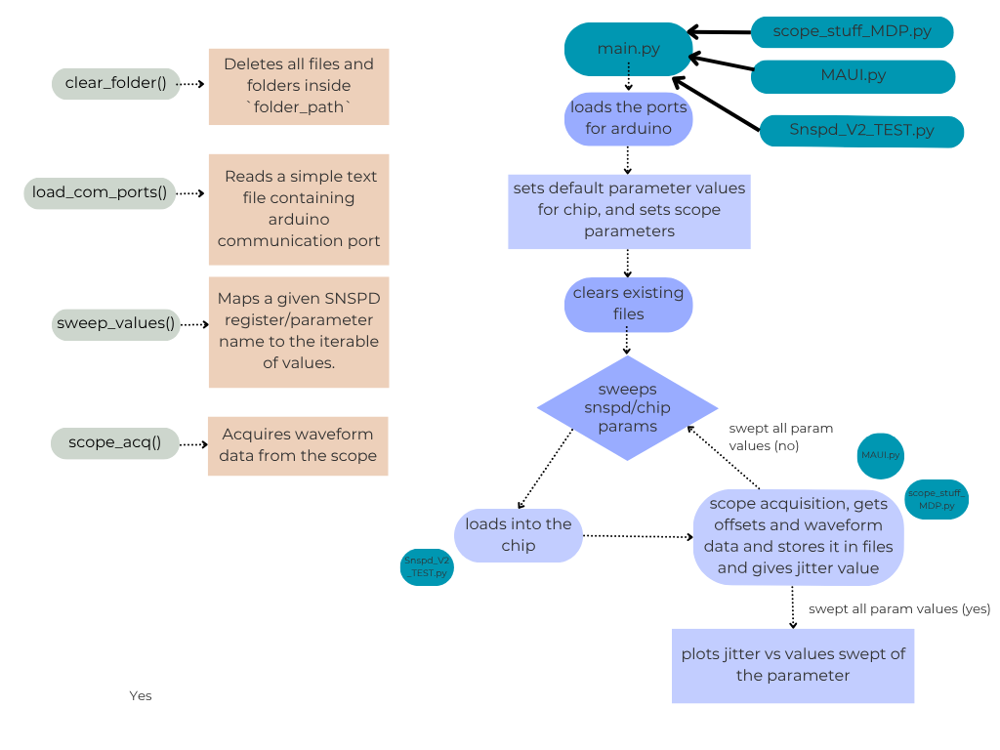
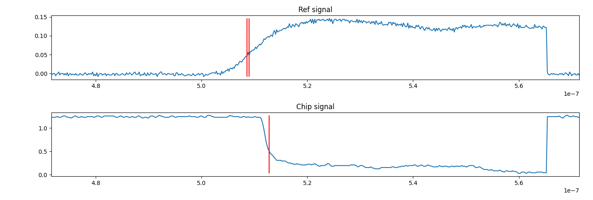
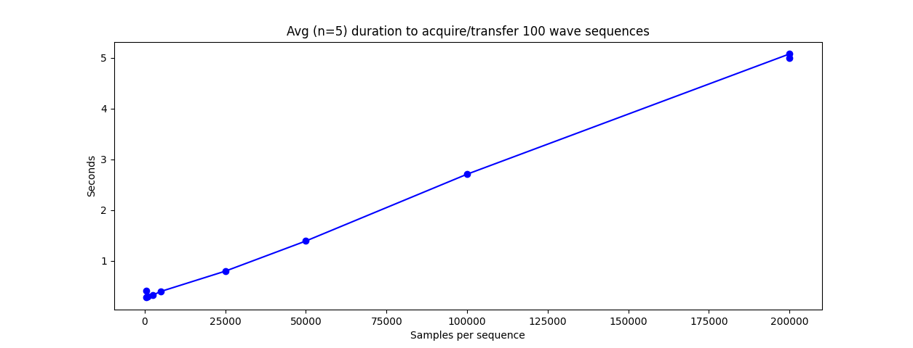
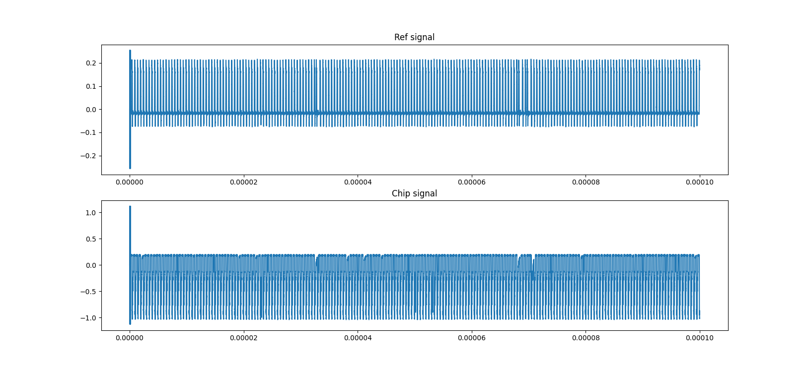
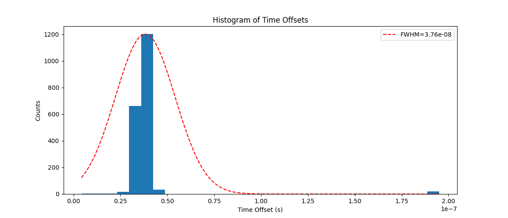
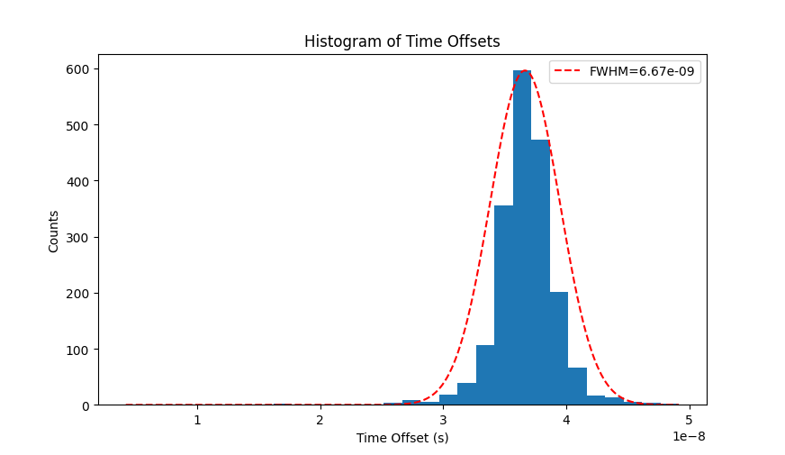
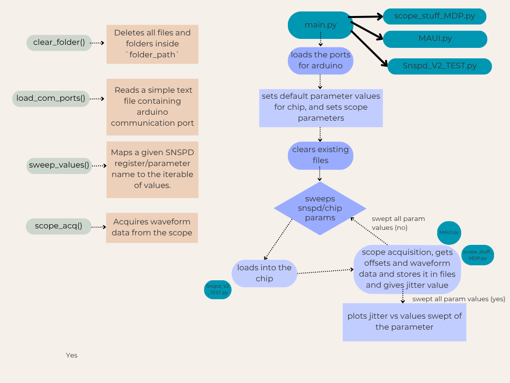

# 
 Automated Jitter Measurement  Documentation 
 

This code is designed to run with Teledyne LeCroy MAUI™ oscilloscopes. The primary intent is to have a set of functions that simplifies the running of jitter measurements. Specifically, a situation where two signals have corresponding edge events with varying time offsets. The jitter is the variation in these offsets over the course of many trigger events.

Here we outline an overview of connecting the scope and the code functionality.

# Connecting the scope with PC
The scope should be connected to the PC via ethernet on a local network. We additionally used a switch as an intermediate between the PC and scope. Proper connectivity should be confirmed by first pinging the scope from the PC and then attempting to ping the PC from the scope.

### Disable firewall
An important note is that the default scope settings have a firewall enabled that prevents other devices on the local network from interfacing with it. To bypass this you must disable these settings (via the standard Windows 10 interface), which requires admin credentials. By default these are 

 Username: LCRYADMIN 
 

 Password: SCOPEADMIN 
 

### IP address
When the scope is connected to a local network it will have a distinct IP address. This can be found either by typing "ipconfig" in the windows command line, or in the native scope software by going to Utilities > Utilities Setup > Remote. The IP address should be displayed. 

You will know the scope and PC are properly connected if you can add and see the scope on NI Max under "Network Devices".

### Control Drivers
There are two drivers that can be used to remotely control the scope through python. These are the VISA driver and the ActiveDSO driver. They both work to rovide an interface to transfer data between the PC and scope. 

The `MAUI.py` file is written to work through ActiveDSO. For this to work you must install the ActiveDSO software. A guide can be found [here.](https://www.teledynelecroy.com/doc/using-python-with-activedso-for-remote-communication) This will require a Teledyne Lecroy account. It will take a few buisiness days to get approval if you're registering one for the first time. 

With that being said, VISA has all the same functionality and in some cases may already be installed on the PC. The syntax is quite similar for the two drivers, and re-writing `MAUI.py` to work with VISA shouldn't be overly convoluted (just a little annoying perhaps).

# Overview of Files
Once you've connected to the scope through the appropriate interface, you may begin sending commands. The full documentation for remote control can be found [here](https://www.mouser.com/pdfDocs/maui-remote-control-and-automation-manual.pdf?srsltid=AfmBOopTUiOzCRKhMw20rTQm8g4ExqgGg3dFMqV92nIm03f7aezunvxA). The key files for the automated jitter measurements are

## `MAUI.py`
The [`MAUI.py`](Scope_Interfacing_Code/MAUI.py) file contains a class that streamlines the connection and control processes outlined in the manual. As mentioned earlier, it will not work without ActiveDSO installed. 

## `scope_stuff_MDP.py`
The [`scope_stuff_MDP.py`](Scope_Interfacing_Code/scope_stuff_MDP.py) file utilizes the class defined in `MAUI.py` for higher level functions directly designed with jitter measurements in mind.

The 3 main functions that get called over the course of a measurement are:

- `extract_waves_multi_seq()` is what will set the acquisition mode and triggers on the scope and then transfer from the 2 channels to the scope as numpy arrays. It also returns the true number of samples as limited by the scope. This is important to have, since it's used by `get_offsets()`
- `get_offsets()` takes two waveforms (each with time and signal data) and then detects rising/falling edges between channels to get the time offset between them. While it's functional, the current implementation is quite inefficient and should be improved. See the **Key Issues to Address** section for more details.
- `make_histogram_and_guassian()` takes offset data and forms it into a histogram. It also has a `stdv_cutoff` parameter that, for nonzero values, will exclude all datapoints more than that many standard deviations from the mean. It will also try to overlay a gaussian who's FWHM is derived from the standard deviation of the filtered data. The accuracy of this fit can be inconsistent - we elaborae in **Key Issues to Address**

## `main.py`
The [`main.py`](main.py) file uses functions from `scope_stuff_MDP.py` to outline a protocol that includes adjusting the chip parameters through a connected arduino. Running this file sweeps a chip parameter, triggers the MAUI scope, pulls burst sequences, computes timing offsets between the two channels, saves raw waveforms and offsets, and exports a histogram.

A directory to store the waveform and jitter data is created at `C:\\LeCroy\\ScopeData`. Within this directory we'll store folders with data corresponding to the specific chip parameter and value being investigated at that moment

Within each waveform folder there will be `num_loops` number of `.npy` files with waveform sequences.

There will also be a `.txt` file that stores offset values. Whie the program is running there will be multiple such files for every loop, but at the end these are all concantenated into one large file for a parameter and value.

The `SLOW_SPI_COM_TEST.py` is called by `main.py` to establish connection with the chip (via an intermediate arduino) and to set key parameters.

After this, the PC will set up the scope to acquire and transfer data. The data is then saved in folders named with the convention 

## Key Issues to Address
Our work is incredibly effective at automating the collection of rising/falling edge waveforms from the scope as we sweep chip parameters. However, the actual processing of those waveforms to properly calculate the delay between edges still has room for improvement. 

Here we address some key points to address and be aware of moving forward: 

### Timing Imprecission When Multiple Edges Detected
The `get_offsets()` function takes sequences of waveforms for both the reference and chip signals and attempt to explicitly calculate the number of time rising/falling edges for the reference/chip signals, respectively. If this number is the same for both, then things proceed very smoothly and everything works as planned.

However, what happens the vast majority of the time is that there will be a mismatch. In such a case, you have two options depending on how you set the `mismatch_handling` parameter:

- If `mismatch_handling == False`, the function will simply return a `ValueError` and, at least in `main.py`, the PC will simply delete that sequence and try to get new data for that loop

- If `mismatch_handling == True`, the function will attempt to take the waveform sequences and break them into their individual acquisition windows. It will then iterate through all `N` windows and try to find edge delays between channels for each.

The second option is generally preferable. It means we can still get data from a sequence we'd otherwise discard. And the likelihood of edge crossing events corresponding perfectly between channels is low.

However, a very common problem arises where multiple detection events are identified where they shouldn't be. For example: 

In the figure above, the code detected 2 events for the reference signal, but only one for the chip. In this case, the function would simply move past this portion of the sequence and go on to the next. 

What we do now is take the average of the multiple detection events and use that as the location of the edge. While this works in instances like the one above, it's not robust to all edge cases.

The frequency and severity of this issue varies depending on the scope settings, but it's one of the key issues to address moving forward.

### Setting samples per acquisition 
The maximum number of samples acquired in each acquisition segment can be set manually in `main.py` with the `num_samples` parameter. However the scope will convert this to its nearest acceptable value. The specific allowed sample values will be limited by memory constraints and internal settings based on other parameters you may set. 

For example, if you set the number of acquisitions per sequence to be `N=10000`, the allowed maximum number of samples per acquisition will likely be much lower than with a smaller number of acquisitions.

You can find the true number of samples per acquisition from the output of `MAUI().query("""VBS? 'return=app.acquisition.horizontal.maxsamples'""")` using the class from the `MAUI.py` file.

The time it takes to get data in sequence mode depends on a number of factors. However a general sense can be gained from the plot below. Each acquisition was taken over a 10 $\mu\text{s}$ window, and 100 acquisitions were taken per sequence:

Note: This only accounts for the time to extract data from the scope as a numpy array. It does NOT include the time it takes to store the wave data to the PC

Another important metric to keep in mind with regards to samples per sequence is memory. We found that, when storing 100 waveforms each with 10,000 samples (so 1,000,000 datapoints) as a CSV file, it was around 50 KB of data.

### Metadata in data causing problems
When collecting waveform data in sequence mode, we noticed that the first acquisition always has unusual spiking behavior in the beginning. The sequence below shows this:

This is because, when the scope sends data to the PC, the first chunk o bytes will be metadata describing various settings for the waveform. Unfortunately the _specific length_ of this metadata varies significantly depending on the settings used for acquiring data. Changing `num_samples`, `N`, `num_loops`, `div_time`, etc will all alter this initial description data.

We address this in our `extract_waves_multi_seq()` function on lines 242 and 243 (found in `scope_stuff_MDP.py`). We take all the data from the scope, and clip from the end only the `num_samples*N` datapoints we expect.

While this is better than nothing, a more proper approach would be to go through the metadata and use the information there to isolate signal data. We unfortunately didn't have time to pursue this.

### Extreme Outlier Data

**NOTE:** The histogram fitting in these plots comes from an outdated version of the code. The outlier information is still valid, but fitted Gaussians are much more accurate now.

Often, particularly for sequences with larger `N` waveforms in them, there will be extreme but consistent outliers in the data:

This is likely due (again) to the `get_offsets()` function. As mentioned above, the function *attempts* to break the sequence of `N` waveforms evenly into individual windows. However this process assumes that there are exactly `N*num_samples` datapoints

If we take the same dataset, but then omit any data more than 4 standard deviations away from the mean, we get the following plot:

The counts have changed between the two figures because the bins have been reconfigured. As you can see, the FWHM in the latter examples is much more characteristic of the normal distribution.

### How scope data is saved (from main.py)
Base dir: C:\LeCroy\ScopeData
For each sweep value, three folders are recreated:

1. ReferenceWaveforms_{param_name}{sweep_val} in which multiple  ref_data_{loop_val}.npy files are stored for each loop(num_loop)
2. ChipWaveforms_{param_name}{sweep_val} --> chip_data_{loop_val}.npy
3. OffsetVals_{param_name}{sweep_val} --> offset_vals_{param}{val}_{loop_val}.txt

A combined offset_val, that is combining all the files in OffsetVals_{param_name}{sweep_val} is written as: offset_values_all_{param_name}{sweep_val}.txt into Base_dir

A combined histogram plot of offset values is written as: hist_{param_name}{sweep_val}.png into Base_dir

We have saved the data this way because as we increase the N value, the scope is missing out on a few detections. Hence, to reduce such events by using a lower N, we have done it multiple times(num_loops).

## Overview main.py

Running this file sweeps a chip parameter, triggers the MAUI scope, pulls burst sequences, computes ref(AWG) vs chip timing offsets, saves raw waveforms and offsets, and exports a histogram.

Here, 
sweep_ranges(param_name) returns numeric sweep values with adjustable step.

scope_acq(param_name, sweep_val, num_samples, N, num_loops, div_time, hold_time, 
          ref_channel, chip_channel, ref_thresh, chip_thresh, delete_prev_data, std_cutoff)

Collects num_loops sequences of N waveforms with num_samples points, saves .npy files for ref/chip and offset text files, then makes hist_*.png.

